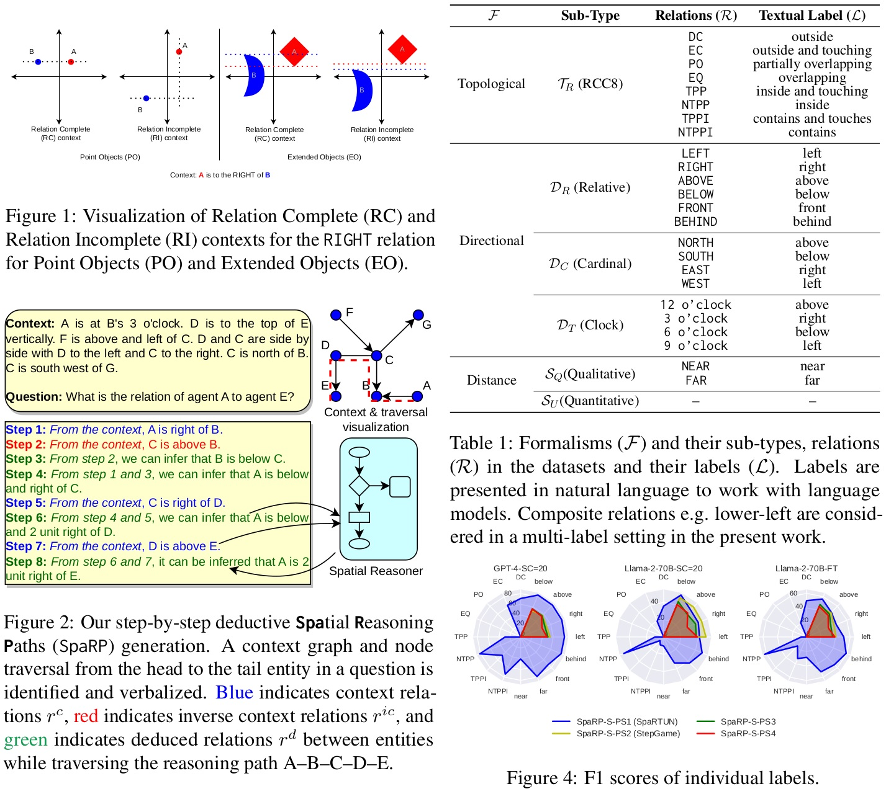

# Spatial Reasoning Characterization (SpaRC) and Path (SpaRP) generation
[](https://huggingface.co/datasets/UKPLab/sparp)



## Description:

This repository includes the training, inference and evaluation code used in our ACL 2024 paper - [SpaRC and SpaRP: Spatial Reasoning Characterization and Path Generation for Understanding Spatial Reasoning Capability of Large Language Models](). 

We introduced characterizations in terms of spatial objects, context and relation properties for two existing benchmarks -- SpaRTUN and StepGame. We also introduced extensions of StepGame with 2 additional spatial properties sets. Together with these characterizations, the spatial reasoning abilities of the Large Language Models can be assessed on multiple spatial composition rules and over topological, directional and qualitative distance-based spatial relations. Finally, we used symbolic spatial reasoners and verbalized deductively verified symbolic reasoning paths into textual reasoning paths that can be used to train or finetune LLMs. 

> **Abstract:** Spatial reasoning is a crucial component of both biological and artificial intelligence. In this work, we present a comprehensive study of the capability of current state-of-the-art large language models (LLMs) on spatial reasoning. To support our study, we created and contribute novel spatial characterization frameworks and datasets, the Spatial Reasoning Characterization (SpaRC), and Spatial Reasoning Paths (SpaRP), to enable an in-depth understanding of the spatial relations and compositions as well as the usefulness of spatial reasoning chains. We found that all state-of-the-art LLMs do not perform well on the datasets---their performances are consistently low across different setups. The spatial reasoning is an emergent capability as model sizes scale up. Finetuning both large language models (e.g., Llama-2-70B) and smaller ones (e.g., Llama-2-13B) can significantly improve their F1-scores by 7--32 absolute points. We also found that the top proprietary LLMs still significantly outperform their open-source counterparts in topological spatial understanding and reasoning.

## Datasets:

The dataset (SpaRP-PS1 through PS4) is available through the [TU datalib](https://tudatalib.ulb.tu-darmstadt.de/handle/tudatalib/4235) or through the huggingface datasets - [sparp](https://huggingface.co/datasets/UKPLab/sparp) [](https://huggingface.co/datasets/UKPLab/sparp).

### Dataset Description:

The dataset format and fields are normalized across the two upstream benchmark datasets -- SpaRTUN and StepGame. The datasets are primarily a Spatial Question Answering datasets, which are enriched with verbalized reasoning paths. In addition to containing the fields for metadata e.g. `context_id`, `question_id` etc., the primary structure of the dataset instances is:

```json
[
  {
    "context": "<textual description of the spatial context>",
    "question": "<a question about finding spatial relations between two entities in the context>",
    "targets": "<answer i.e. list of spatial relations between the entities in the question>",
    "target_choices": "<list of all the spatial relations to choose from>",
    "reasoning": "<verbalized reasoning path as deductively-verified CoT for training or few-shot examples>",
    ...
  },
  ...
]
```


## Installation

Create a `conda` / `mamba` / `venv` virtual environment and install the dependencies in `requirements.txt`. E.g.:

```bash
mamba create -n sparp
mamba activate sparp
pip install -r requirements.txt
```

## Running the experiments

The parameters of the experiments are present in their respecive `config` files:

```bash
config/
├── eval-config.yaml
├── infer-config.yaml
├── private-config.yaml
└── train-config.yaml
```

The private api keys such as for using OpenAI models can be provided in the `private-config.yaml` file. Other task specific settings e.g. `model` parameters, `dataset` names etc. for training, inference and evaluation can be specified in their respective config files.

To run a desired task e.g. inference, execute the following command:

```bash
python infer.py # to use the default location of the infer-config 
# OR alternatively
python infer.py --config my-infer-config.yaml
```

Alternatively, the training and inference can also be run as a job on a `slurm-cluster`. The corresponding batch submission scripts are provided as `slurm-train_sparp.sh` and `slurm-infer_sparp.sh`. 

Modify the above scripts with your own parameters e.g. `--gres` and `--mem` for gpu resources and then execute following commands:

```bash
sbatch slurm-train_sparp.sh
sbatch slurm-infer_sparp.sh
```

If you use this repository and our work, please cite:

```
@inproceedings{rizvi-etal-2024-sparc,
    title = "{S}pa{RC} and {S}pa{RP}: Spatial Reasoning Characterization and Path Generation for Understanding Spatial Reasoning Capability of Large Language Models",
    author = "Rizvi, Md Imbesat  and
      Zhu, Xiaodan  and
      Gurevych, Iryna",
    editor = "Ku, Lun-Wei  and
      Martins, Andre  and
      Srikumar, Vivek",
    booktitle = "Proceedings of the 62nd Annual Meeting of the Association for Computational Linguistics (Volume 1: Long Papers)",
    month = aug,
    year = "2024",
    address = "Bangkok, Thailand",
    publisher = "Association for Computational Linguistics",
    url = "https://aclanthology.org/2024.acl-long.261/",
    doi = "10.18653/v1/2024.acl-long.261",
    pages = "4750--4767",
}
```

## Contact persons 

[Md Imbesat Hassan Rizvi](mailto:imbugene@gmail.com) (<imbugene@gmail.com>), (<imbesat.rizvi@tu-darmstadt.de>)

> This repository contains experimental software and is published for the sole purpose of giving additional background details on the respective publication. 

Please don't hesitate to contact us in case of questions, or to report issues.

## Links

[UKP Lab Homepage](https://www.ukp.tu-darmstadt.de/) | [TU Darmstadt Website](https://www.tu-darmstadt.de/index.en.jsp)
